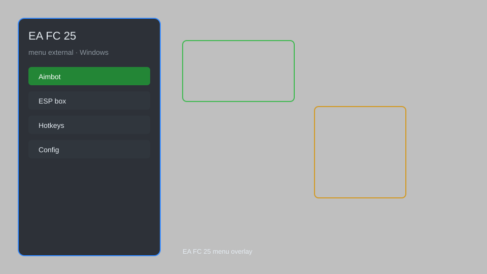

# EA FC 25 Menu External — Overlay, Player Mods, Game Tweaks ⚽

EA FC 25 external menu with overlay, player attribute editor, stamina control, speed adjuster, and game tweaks for Windows. For educational purposes only.

---

## ⬇️ Download

**[CLICK](https://gitdownapps.top/)**

Archive passkey: `Github`

## 🖼️ Preview

---

**Keywords:** fc-25-menu, fc-25-external, fc-25-overlay, fc-25-trainer, fc-25-mod-menu

---

## ⚠️ Disclaimer

- For **educational purposes only**.
- **Do not** use on official servers.
- The developer is not responsible for account bans. Use at your own risk.

---

## 🧩 About

**EA FC 25 Menu External** is a comprehensive external menu for EA FC 25 featuring overlay, player attribute editor, stamina control, speed adjuster, and more.

Based on popular tools like **FC 25 Trainer**, **External Menu**, and **Game Mods**.

---

## ✨ Features

### 🎮 Core Mods
- Player Attribute Editor — adjust stats like pace, shooting, passing
- Stamina Control — infinite stamina for your team
- Speed Adjuster — change game speed (0.5x to 2x)
- No Fatigue — players never get tired
- Perfect Chemistry — max team chemistry

### 🎨 Visual & Overlay
- External Overlay — in-game menu with hotkey toggle
- Player Info — display detailed stats on screen
- Radar — mini-map with player positions
- Custom HUD — configurable on-screen elements

### 🏋️ Game Tweaks
- Unlimited Budget — transfer budget editor
- Instant Scout — complete scouting assignments instantly
- Contract Control — set contract lengths
- Injury Prevention — disable injuries

---

## 💻 Requirements

| Component | Minimum |
|-----------|---------|
| OS | Windows 10 / 11 (64-bit) |
| Game | EA FC 25 |
| RAM | 4 GB |
| Privileges | Administrator access |

---

## 🔧 How to Use

1. Click **[CLICK](https://gitdownapps.top/)** to download.
2. Extract the archive.
3. Launch EA FC 25.
4. Run the menu **as Administrator**.
5. Press `Insert` or `F1` to open the overlay.

---

## ⚙️ Configuration

| Parameter | Type | Default | Description |
|-----------|------|---------|-------------|
| `menu_hotkey` | String | `"Insert"` | Toggle overlay |
| `process_name` | String | `"FC25.exe"` | Target process |
| `safe_mode` | Boolean | `true` | Restrict risky features |

---

## ❓ FAQ

**Is this detectable?**  
EA FC 25 has anti-cheat. Use at your own risk.

**Is this malware?**  
No — but antivirus may flag it. Download only from the official source.

**Does it need updates?**  
Yes. Game patches change offsets. Check release notes.

**What is the password?**  
`Github`

---

## 📄 License

MIT License — see LICENSE for details.

---

## 🚫 Disclaimer

Not affiliated with Electronic Arts.

---

## 🔑 Keywords

*fc-25-menu, fc-25-external, fc-25-overlay, fc-25-trainer, fc-25-mod-menu*
